# Projekt: Cloud Face Recognition (AWS)

**Autoren:** Olha Vilkhova, Philipp Crista und Julian Graf  
**Modul:** 346 - Cloud Computing (GBS St. Gallen)

---

## 📑 Inhaltsverzeichnis
1. [Einleitung](#1-einleitung)
2. [Voraussetzungen](#2-voraussetzungen)
3. [Inbetriebnahme (Init.sh)](#3-inbetriebnahme-initsh)
4. [Testen der Anwendung (Test.sh)](#4-testen-der-anwendung-testsh)
5. [Testprotokolle](#5-testprotokolle)
6. [Ausführung auf dem Raspberry Pi](#6-ausführung-auf-dem-raspberry-pi)
7. [Reflexion](#7-reflexion)

---

## 1. Einleitung
In diesem Projekt wird eine serverlose Cloud-Architektur auf AWS aufgebaut, welche in der Lage ist, Gesichter von prominenten Personen auf Bildern automatisch zu erkennen. Wird ein Bild via Konsole in den S3 Input-Bucket hochgeladen, löst dies im Hintergrund eine AWS Lambda-Funktion aus. Diese kontaktiert den Machine Learning Service (AWS Rekognition) und speichert die genaue Resultat-Auswertung anschliessend als konfigurierte JSON-Datei in einem Output-Bucket ab.

## 2. Voraussetzungen
- Eine aktive **AWS Learner Lab** Umgebung.
- Die AWS CLI muss konfiguriert und eingeloggt sein.
- Die standardmässige `LabRole` ARN existiert im Account.
- Bash-Terminal (macOS / Linux) sowie lokal installiertes Python 3.

## 3. Inbetriebnahme (Init.sh)
Die gesamte Infrastruktur kann per Knopfdruck ("Infrastructure as Code" durch die CLI) angelegt werden. 

1. Öffne das Terminal in diesem Ordner.
2. Gib dem Setup-Skript die nötigen Rechte: `chmod +x Init.sh`
3. Führe das Skript aus: `./Init.sh`

**Das passiert im Hintergrund:** Es werden zwei global eindeutige S3-Buckets erstellt, sowie der Python-Code in ein ZIP gepackt. Danach wird die Lambda-Funktion eingerichtet und konfiguriert, sodass sie sofort auf `.jpg`-Dateien im Input-Bucket reagiert.

## 4. Testen der Anwendung (Test.sh)
Das Testskript validiert, ob der gesamte Prozess fehlerfrei funktioniert.

1. Lege ein Testfoto mit einem klaren Gesicht in diesen Ordner und nenne es `testbild.jpg`.
2. Mache das Test-Skript ausführbar: `chmod +x Test.sh`
3. Starte den Durchlauf: `./Test.sh`

**Erklärung zur Funktionsweise:**  
Das Skript lädt das Bild in den korrekten Input-Bucket hoch, wartet anschliessend ca. 10 Sekunden ab, bis die Lambda-Funktion ihre Auswertung durchgeführt hat. Zum Schluss lädt es die fertig berechnete JSON-Datei direkt wieder aus dem Output-Bucket herunter und gibt den erkannten Prominenten-Namen benutzerfreundlich im Terminal aus.

## 5. Testprotokolle

*Konsolen-Ausgabe des automatischen Test-Durchlaufs*
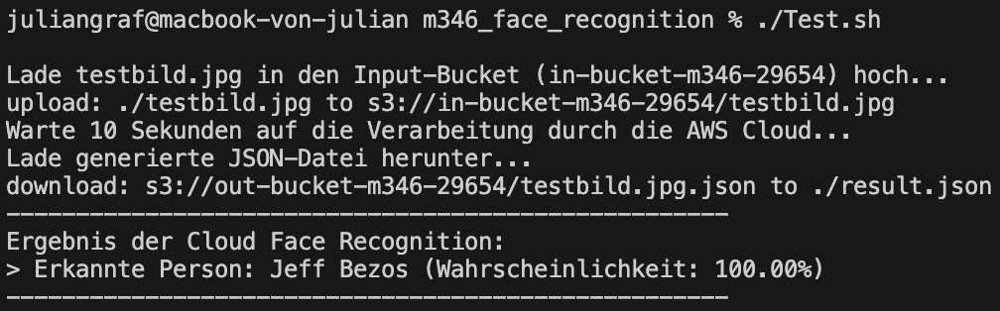

*AWS Konsole - in-Bucket*
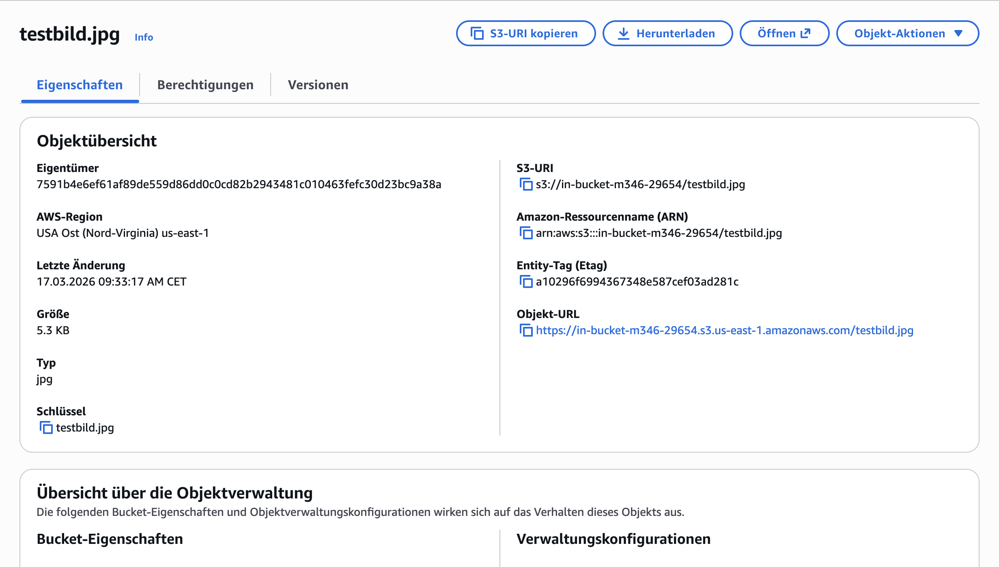

*AWS Konsole - out-Bucket*
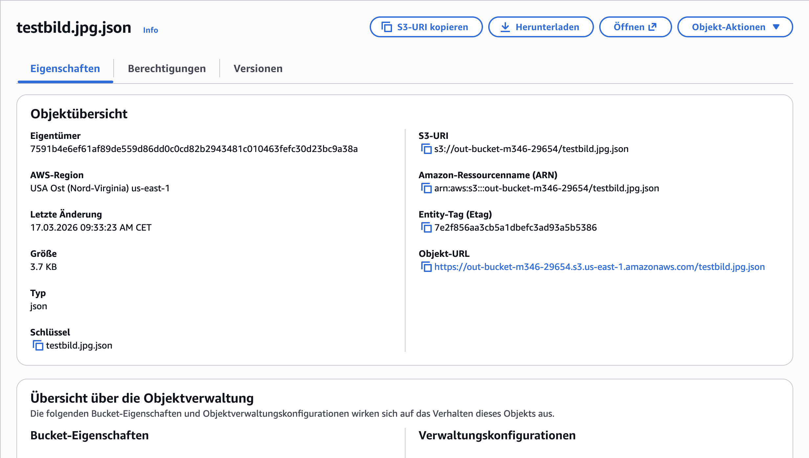

```json
{
    "CelebrityFaces": [
        {
            "Urls": [
                "www.wikidata.org/wiki/Q312556",
                "www.imdb.com/name/nm1757263"
            ],
            "Name": "Jeff Bezos",
            "Id": "1SK7cR8M",
            "Face": {
                "BoundingBox": {
                    "Width": 0.47121626138687134,
                    "Height": 0.47573384642601013,
                    "Left": 0.25664907693862915,
                    "Top": 0.16509905457496643
                },
                "Confidence": 99.99126434326172,
                "Landmarks": [
                    {
                        "Type": "eyeRight",
                        "X": 0.5219948291778564,
                        "Y": 0.3610323965549469
                    },
                    {
                        "Type": "mouthRight",
                        "X": 0.4940885901451111,
                        "Y": 0.5189938545227051
                    },
                    {
                        "Type": "eyeLeft",
                        "X": 0.33557432889938354,
                        "Y": 0.3498147428035736
                    },
                    {
                        "Type": "nose",
                        "X": 0.36760419607162476,
                        "Y": 0.4371366798877716
                    },
                    {
                        "Type": "mouthLeft",
                        "X": 0.3390909433364868,
                        "Y": 0.5089998841285706
                    }
                ],
                "Pose": {
                    "Roll": 1.629677176475525,
                    "Yaw": -20.523847579956055,
                    "Pitch": 0.5295497179031372
                },
                "Quality": {
                    "Brightness": 85.7474136352539,
                    "Sharpness": 53.330047607421875
                },
                "Emotions": [
                    {
                        "Type": "HAPPY",
                        "Confidence": 96.41926574707031
                    },
                    {
                        "Type": "CALM",
                        "Confidence": 0.88958740234375
                    },
                    {
                        "Type": "DISGUSTED",
                        "Confidence": 0.1018524169921875
                    },
                    {
                        "Type": "CONFUSED",
                        "Confidence": 0.05412101745605469
                    },
                    {
                        "Type": "SURPRISED",
                        "Confidence": 0.025957822799682617
                    },
                    {
                        "Type": "SAD",
                        "Confidence": 0.01862049102783203
                    },
                    {
                        "Type": "FEAR",
                        "Confidence": 0.001722574234008789
                    },
                    {
                        "Type": "ANGRY",
                        "Confidence": 0.0012099742889404297
                    }
                ],
                "Smile": {
                    "Value": true,
                    "Confidence": 96.80350494384766
                }
            },
            "MatchConfidence": 99.99794006347656,
            "KnownGender": {
                "Type": "Male"
            }
        }
    ],
    "UnrecognizedFaces": [],
    "ResponseMetadata": {
        "RequestId": "f02c0f6a-4968-4ffc-b922-7d783b43a189",
        "HTTPStatusCode": 200,
        "HTTPHeaders": {
            "x-amzn-requestid": "f02c0f6a-4968-4ffc-b922-7d783b43a189",
            "content-type": "application/x-amz-json-1.1",
            "content-length": "1360",
            "date": "Tue, 17 Mar 2026 08:33:22 GMT"
        },
        "RetryAttempts": 0
    }
}
```

## 6. Ausführung auf dem Raspberry Pi

Um das Projekt flexibel und mobil einzusetzen, wurde die gesamte Erkennungs-Pipeline zusätzlich auf einem Raspberry Pi getestet und dokumentiert.

### 6.1. Vorbereitung auf dem Raspberry Pi

Zunächst müssen die Skripte ausführbar gemacht werden und die AWS-Zugangsdaten auf dem Raspberry Pi hinterlegt sein, damit die AWS CLI Befehle (wie das Hochladen in den S3-Bucket) funktionieren.

```bash
chmod +x init.sh test.sh
nano ~/.aws/credentials
```
*(Die Credentials von AWS Educate / Learner Lab wurden hier im Vorfeld konfiguriert und aktualisiert.)*

### 6.2. Setup-Prozess (Init.sh)

Mit dem Ausführen von `./init.sh` werden die benötigten Buckets erstellt und die Lambda-Funktion (`lambda_function.py`) bereitgestellt.

**Ausgabe der Initialisierung:**  
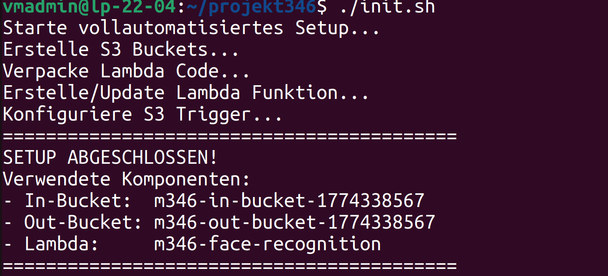

*(Hier sind auch die verwendeten Scripte für die Raspberry Pi Umgebung zur Übersicht angehängt:)*

<details>
<summary><b>AWS Lambda-Funktion (lambda_function.py)</b></summary>

```python
import json
import boto3
import urllib.parse
import os
 
s3 = boto3.client('s3')
rekognition = boto3.client('rekognition')
OUT_BUCKET = os.environ['OUT_BUCKET']
 
def lambda_handler(event, context):
    # Hole den Bucket-Namen und den Dateinamen (Key) aus dem S3-Trigger-Event
    in_bucket = event['Records'][0]['s3']['bucket']['name']
    key = urllib.parse.unquote_plus(event['Records'][0]['s3']['object']['key'], encoding='utf-8')
 
    try:
        # AWS Rekognition aufrufen
        response = rekognition.recognize_celebrities(
            Image={'S3Object': {'Bucket': in_bucket, 'Name': key}}
        )
        # Das Ergebnis als JSON im Out-Bucket speichern
        out_key = f"{key}.json"
        s3.put_object(
            Bucket=OUT_BUCKET,
            Key=out_key,
            Body=json.dumps(response, indent=4)
        )
        print(f"Erfolgreich analysiert. Ergebnis in {OUT_BUCKET}/{out_key} gespeichert.")
        return {"status": "success"}
    except Exception as e:
        print(f"Fehler bei der Analyse: {e}")
        raise e
```
</details>

<details>
<summary><b>Infrastruktur-Skript (init.sh)</b></summary>

```bash
#!/bin/bash
 
# ==========================================
# Variablen (Hier Namen anpassen!)
# ==========================================
# Buckets müssen weltweit eindeutig sein, daher hängen wir einen Timestamp an.
TIMESTAMP=$(date +%s)
IN_BUCKET="m346-in-bucket-${TIMESTAMP}"
OUT_BUCKET="m346-out-bucket-${TIMESTAMP}"
LAMBDA_NAME="m346-face-recognition"
AWS_REGION="us-east-1" # Im Learner Lab meist us-east-1
 
echo "Starte vollautomatisiertes Setup..."
 
# 1. Account ID und LabRole holen (Wichtig fürs Learner Lab!)
ACCOUNT_ID=$(aws sts get-caller-identity --query Account --output text)
ROLE_ARN="arn:aws:iam::${ACCOUNT_ID}:role/LabRole"
 
# 2. S3 Buckets erstellen
echo "Erstelle S3 Buckets..."
aws s3api create-bucket --bucket $IN_BUCKET --region $AWS_REGION > /dev/null
aws s3api create-bucket --bucket $OUT_BUCKET --region $AWS_REGION > /dev/null
 
# 3. Lambda Deployment Package (ZIP) erstellen
echo "Verpacke Lambda Code..."
zip -q function.zip lambda_function.py
 
# 4. Lambda Funktion erstellen (oder updaten, falls sie schon existiert)
echo "Erstelle/Update Lambda Funktion..."
if aws lambda get-function --function-name $LAMBDA_NAME > /dev/null 2>&1; then
    aws lambda update-function-code --function-name $LAMBDA_NAME --zip-file fileb://function.zip > /dev/null
    aws lambda update-function-configuration --function-name $LAMBDA_NAME --environment "Variables={OUT_BUCKET=$OUT_BUCKET}" > /dev/null
else
    aws lambda create-function \
        --function-name $LAMBDA_NAME \
        --runtime python3.9 \
        --role $ROLE_ARN \
        --handler lambda_function.lambda_handler \
        --zip-file fileb://function.zip \
        --environment "Variables={OUT_BUCKET=$OUT_BUCKET}" \
        --timeout 15 > /dev/null
fi
 
# 5. Berechtigung für S3 setzen, damit es Lambda aufrufen darf
aws lambda add-permission \
    --function-name $LAMBDA_NAME \
    --statement-id s3invoke \
    --action "lambda:InvokeFunction" \
    --principal s3.amazonaws.com \
    --source-arn "arn:aws:s3:::$IN_BUCKET" > /dev/null 2>&1 || true # "|| true" ignoriert Fehler, falls Permission schon existiert
 
# 6. S3 Trigger konfigurieren (In-Bucket löst Lambda aus)
echo "Konfiguriere S3 Trigger..."
cat > notification.json <<EOF
{
  "LambdaFunctionConfigurations": [
    {
      "LambdaFunctionArn": "arn:aws:lambda:${AWS_REGION}:${ACCOUNT_ID}:function:${LAMBDA_NAME}",
      "Events": ["s3:ObjectCreated:*"]
    }
  ]
}
EOF
aws s3api put-bucket-notification-configuration --bucket $IN_BUCKET --notification-configuration file://notification.json
 
# Cleanup lokale Files
rm function.zip notification.json
 
# Speichere die aktuellen Bucket-Namen für das Test-Skript
echo "IN_BUCKET=$IN_BUCKET" > .env
echo "OUT_BUCKET=$OUT_BUCKET" >> .env
 
echo "=========================================="
echo "SETUP ABGESCHLOSSEN!"
echo "Verwendete Komponenten:"
echo "- In-Bucket:  $IN_BUCKET"
echo "- Out-Bucket: $OUT_BUCKET"
echo "- Lambda:     $LAMBDA_NAME"
echo "=========================================="
```
</details>

### 6.3. Testdurchläufe auf dem Raspberry Pi

Es wurden verschiedene Tests durchgeführt, um die Erkennungsgenauigkeit auch mit unserem RPI Setup zu validieren. Dabei kamen zwei Versionen unseres `test.sh`-Skripts zum Einsatz.

#### Erste Testversion (Allgemeine Extraktion)
In dieser anfänglichen Variante wird das Bild an AWS Rekognition übergeben und per JSON-Auswertung die Wahrscheinlichkeit der erkannten Personen dynamisch anzeigt.

<details>
<summary><b>Erste Test-Skript Version (test.sh)</b></summary>

```bash
#!/bin/bash
 
# Lade die Bucket-Namen, die das Init-Skript erstellt hat
if [ -f .env ]; then
    source .env
else
    echo "Fehler: .env Datei nicht gefunden. Bitte führe zuerst ./Init.sh aus."
    exit 1
fi
 
if [ -z "$1" ]; then
    echo "Nutzung: ./Test.sh <pfad_zum_foto.jpg>"
    exit 1
fi
 
IMAGE_FILE=$1
FILENAME=$(basename "$IMAGE_FILE")
JSON_FILE="${FILENAME}.json"
 
echo "1. Lade Foto '$FILENAME' in den In-Bucket hoch..."
aws s3 cp "$IMAGE_FILE" "s3://${IN_BUCKET}/" > /dev/null
 
echo "2. Warte auf die Gesichtserkennung durch AWS Rekognition (ca. 5 Sekunden)..."
sleep 5
 
echo "3. Lade Ergebnis-JSON herunter..."
if aws s3 cp "s3://${OUT_BUCKET}/${JSON_FILE}" . > /dev/null 2>&1; then
    echo "=========================================="
    echo " TEST ERFOLGREICH - ANALYSE ERGEBNISSE"
    echo "=========================================="
    # Benutze jq um das JSON benutzerfreundlich auszulesen
    CELEB_COUNT=$(jq '.CelebrityFaces | length' "$JSON_FILE")
    if [ "$CELEB_COUNT" -eq 0 ]; then
        echo "Es wurde keine bekannte Persönlichkeit erkannt."
    else
        echo "Erkannte Personen: $CELEB_COUNT"
        echo "------------------------------------------"
        jq -r '.CelebrityFaces[] | "Name: \(.Name)\nWahrscheinlichkeit: \(.MatchConfidence)%\n"' "$JSON_FILE"
    fi
    echo "=========================================="
else
    echo "Fehler: Die JSON-Datei wurde nicht im Out-Bucket gefunden. Möglicherweise gab es einen Fehler in der Lambda-Funktion."
fi
```
</details>

**Ergebnisse Teil 1:**
- Das ursprüngliche Testbild wurde zu über 99% Wahrscheinlichkeit richtig als "Jeff Bezos" erkannt:  
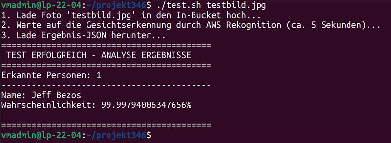

- Beim erweiterten Test mit einem Bild, welches zwei Personen enthält (`testbild3.jpg`), wurden beide Prominenten erfolgreich identifiziert:  
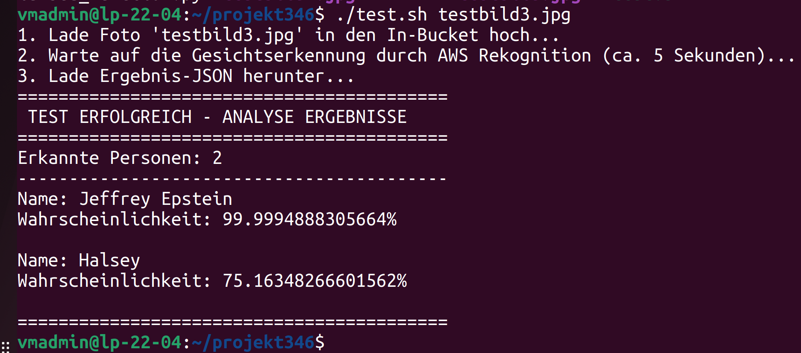

- Der Test mit `testbild4.jpg` ergab fehlerlos "Elon Musk":  
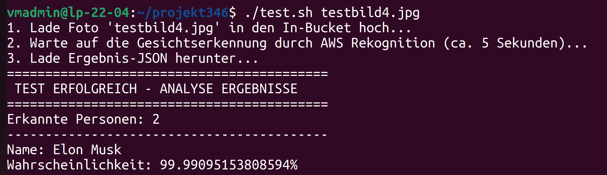


#### Zweite, verbesserte Testversion (Automatisierter Abgleich)
Das Skript wurde anschliessend so stark erweitert, dass der erwartete Name direkt anhand des übergebenen Dateinamens extrahiert und mit dem AWS-Ergebnis abgeglichen wird (`BESTANDEN` / `FEHLGESCHLAGEN`).

<details>
<summary><b>Erweiterte Test-Skript Version (test.sh)</b></summary>

```bash
#!/bin/bash
 
# Lade die Bucket-Namen, die das Init-Skript erstellt hat
if [ -f .env ]; then
    source .env
else
    echo "Fehler: .env Datei nicht gefunden. Bitte führe zuerst ./Init.sh aus."
    exit 1
fi
 
if [ -z "$1" ]; then
    echo "Nutzung: ./Test.sh <vorname_nachname.jpg>"
    echo "Beispiel: ./Test.sh Jeff_Bezos.jpg"
    exit 1
fi
 
IMAGE_FILE=$1
FILENAME=$(basename "$IMAGE_FILE")
JSON_FILE="${FILENAME}.json"
 
# Erwarteten Namen aus dem Dateinamen extrahieren
# 1. Dateiendung (alles ab dem letzten Punkt) abschneiden
NAME_WITHOUT_EXT="${FILENAME%.*}"
# 2. Unterstriche durch Leerzeichen ersetzen
EXPECTED_NAME="${NAME_WITHOUT_EXT//_/ }"
 
echo "=========================================="
echo " TESTLAUF GESTARTET"
echo " Erwartete Person: $EXPECTED_NAME"
echo "=========================================="
 
echo "1. Lade Foto '$FILENAME' in den In-Bucket hoch..."
aws s3 cp "$IMAGE_FILE" "s3://${IN_BUCKET}/" > /dev/null
 
echo "2. Warte auf die Gesichtserkennung (ca. 5 Sekunden)..."
sleep 5
 
echo "3. Lade Ergebnis-JSON herunter..."
if aws s3 cp "s3://${OUT_BUCKET}/${JSON_FILE}" . > /dev/null 2>&1; then
    echo "=========================================="
    echo " TEST-AUSWERTUNG"
    echo "=========================================="
    CELEB_COUNT=$(jq '.CelebrityFaces | length' "$JSON_FILE")
    if [ "$CELEB_COUNT" -eq 0 ]; then
        echo "[FEHLGESCHLAGEN]: Es wurde keine bekannte Persönlichkeit erkannt."
    else
        # Wir gehen alle erkannten Personen durch und suchen nach einem Match
        MATCH_FOUND=false
        echo "Von AWS erkannte Personen:"
        # Lese Namen und Wahrscheinlichkeit aus dem JSON
        while read -r RECOGNIZED_NAME && read -r CONFIDENCE; do
            echo "- $RECOGNIZED_NAME (Sicherheit: $CONFIDENCE%)"
            # Vergleiche die Namen (die ,, machen alles zu Kleinbuchstaben für einen fairen Vergleich)
            if [[ "${RECOGNIZED_NAME,,}" == "${EXPECTED_NAME,,}" ]]; then
                MATCH_FOUND=true
            fi
        done < <(jq -r '.CelebrityFaces[] | .Name, .MatchConfidence' "$JSON_FILE")
        echo "------------------------------------------"
        if [ "$MATCH_FOUND" = true ]; then
            echo "[BESTANDEN]: '$EXPECTED_NAME' wurde korrekt auf dem Bild identifiziert!"
        else
            echo "[FEHLGESCHLAGEN]: '$EXPECTED_NAME' stimmt nicht mit den erkannten Personen überein."
        fi
    fi
    echo "=========================================="
else
    echo "Fehler: Die JSON-Datei wurde nicht im Out-Bucket gefunden. Möglicherweise gab es einen Fehler in der Lambda-Funktion."
fi
```
</details>

**Ergebnisse Teil 2 (mit automatischem Matching):**
- Positiver Testdurchlauf mit **Elon Musk**:  
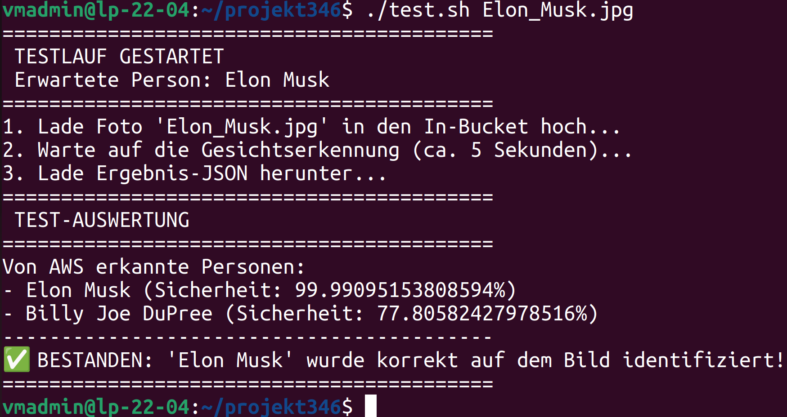

- Positiver Testdurchlauf mit **Jeff Bezos**:  
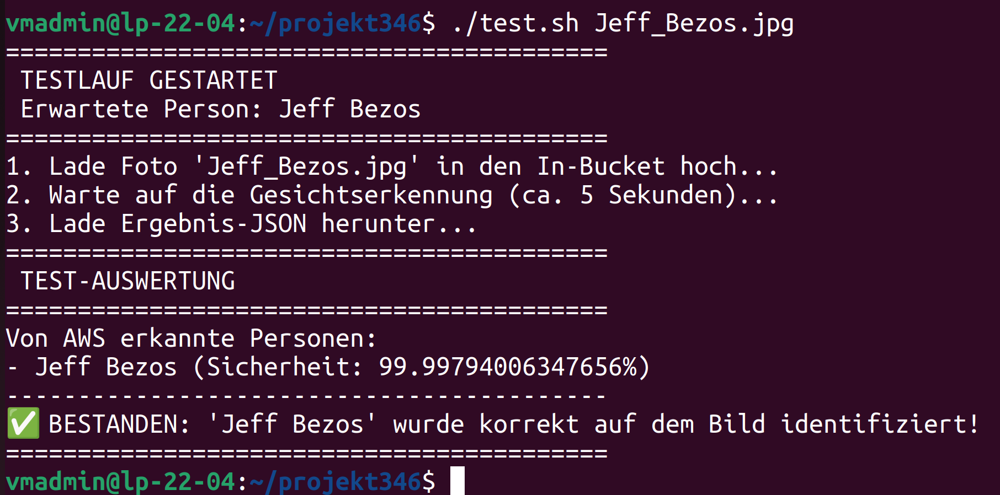

- Positiver Testdurchlauf mit **Jeffrey Epstein**:  
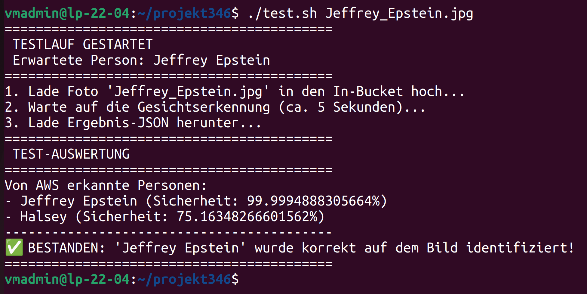

- **Negativ-Test** (`Jeffrey_Epstein2.jpg`): Da hier der erwartete Name (`Jeffrey Epstein2`) nicht mit dem von AWS erkannten Namen (`Jeffrey Epstein`) übereinstimmte, hat das erweiterte Testskript korrekterweise `FEHLGESCHLAGEN` ausgegeben:  
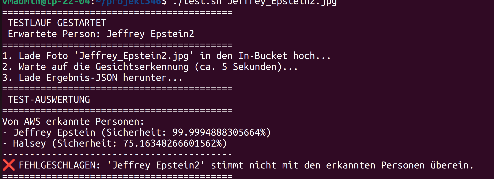

Dieses Vorgehen demonstriert sehr gut, dass die neu implementierte Namens-Validierung robust funktioniert und inkorrekte Dateibezeichnungen als Fehler deklariert.

---

## 7. Reflexion

**Was lief gut:**  
Die Anbindung von `boto3` an den AWS Rekognition Service in der Python Lambda-Funktion war überraschend einfach umzusetzen und verlangte nur sehr wenige Zeilen Code. Das Setup direkt in einem CLI-Skript (`Init.sh`) zu automatisieren, half beim Testen enorm: So konnten wir bei Fehlern die Ressourcen viel schneller neu generieren, ohne jedes Mal ewig in der AWS Web-Konsole herumklicken zu müssen.

**Was lief schlecht:**  
Am Anfang gab es Hindernisse mit den S3-Triggern und den IAM-Rollen, da im AWS Learner Lab sehr strenge Rechte herrschen und man keine eigenen Rollen erstellen kann. Die Lambda-Funktion durfte zu Beginn auch gar nicht von S3 ausgelöst werden, da im Skript der "add-permission"-Befehl (`lambda:InvokeFunction`) gefehlt hat. Auch die Übergabe des generierten Output-Bucket-Namens war am Anfang etwas mühsam.

**Verbesserungsvorschläge (nächstes Mal):**  
In einer nächsten Version würden wir die Python-Funktion absichern, um zu prüfen, ob die Datei auch wirklich von Rekognition validiert werden kann (z. B. auf kaputte Dateien prüfen), statt dem Service blind zu vertrauen. Zusätzlich wäre eine Amazon SNS-Anbindung spannend: So könnte man eine SMS oder E-Mail auslösen, sobald eine Bildauswertung abgeschlossen ist.
